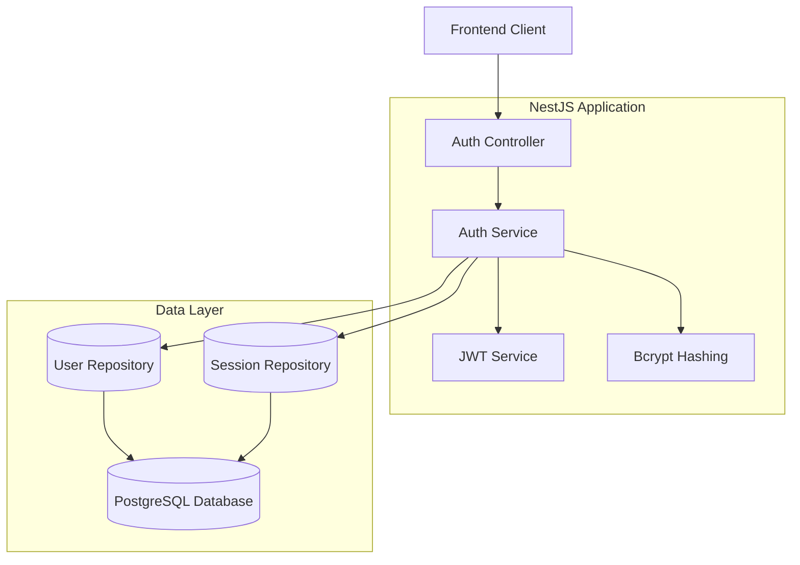
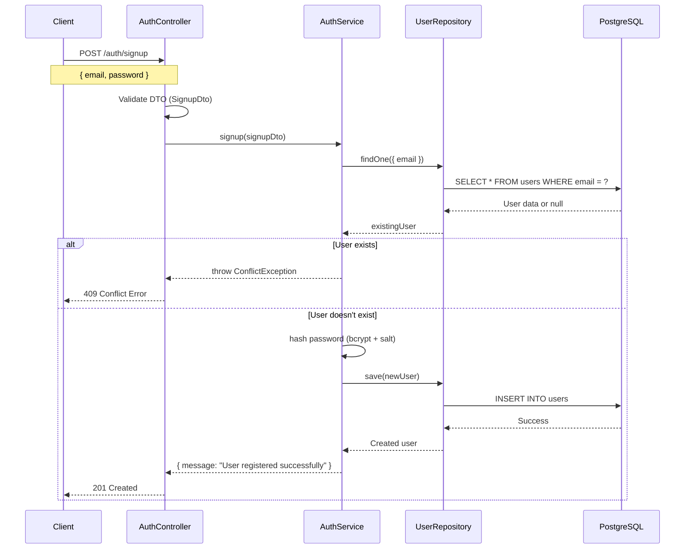
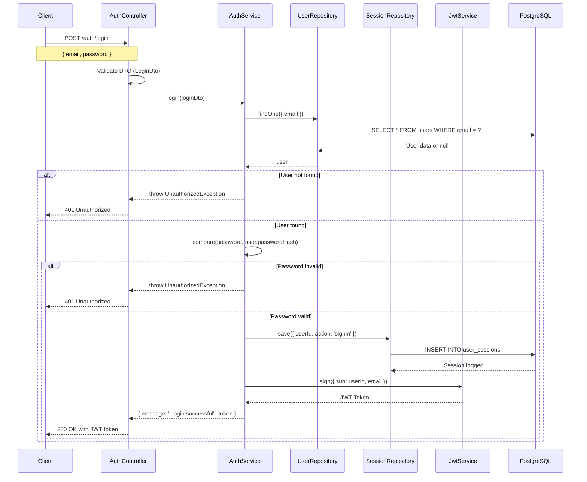
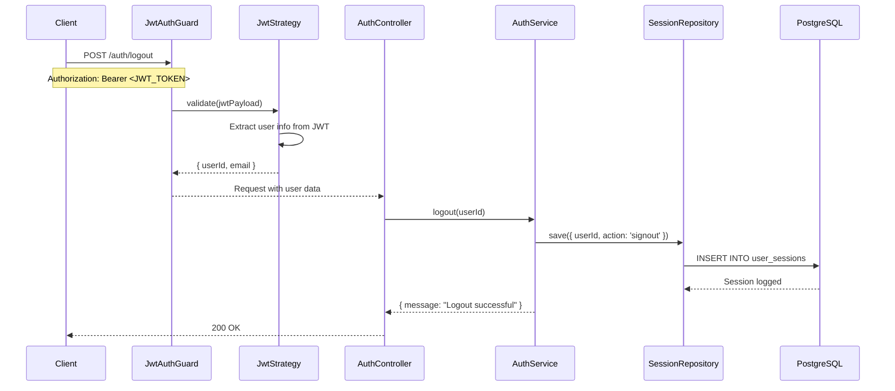
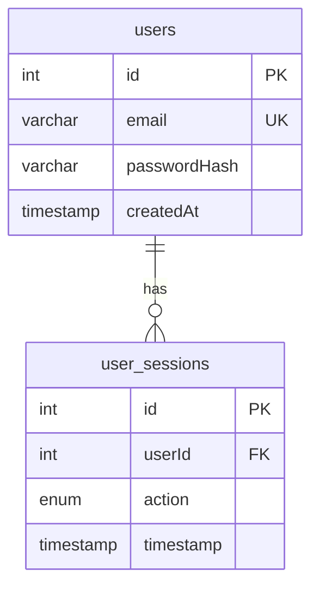

# 🔐 Authentication API - NestJS Backend

<p align="center">
  
</p>

<p align="center">
  A secure, production-ready authentication API built with NestJS, TypeORM, PostgreSQL, and JWT tokens.
</p>

<p align="center">
  
  
  
  
  
</p>

---

## 📋 Table of Contents

- [🎯 Overview](#-overview)
- [🏗️ Architecture](#️-architecture)
- [📁 Project Structure](#-project-structure)
- [🔄 Authentication Flows](#-authentication-flows)
- [🗄️ Database Schema](#️-database-schema)
- [🚀 API Endpoints](#-api-endpoints)
- [⚙️ Setup & Installation](#️-setup--installation)
- [🧪 Testing the API](#-testing-the-api)
- [🔒 Security Features](#-security-features)

---

## 🎯 Overview

This is a **complete authentication API** that provides secure user registration, login, and session management. The system tracks user activities and maintains session logs for signin/signout events.

### Key Features

- ✅ **User Registration** with email validation
- ✅ **JWT-based Authentication** with secure tokens
- ✅ **Password Hashing** using bcrypt with salt rounds
- ✅ **Session Tracking** for user activities
- ✅ **Input Validation** with class-validator
- ✅ **CORS Configuration** for frontend integration
- ✅ **TypeScript Strict Mode** for type safety
- ✅ **PostgreSQL Database** with TypeORM
- ✅ **Docker Support** for easy deployment

---

## 🏗️ Architecture



---

## 📁 Project Structure

```
src/
├── 📁 auth/                          # Authentication module
│   ├── 📁 dto/
│   │   └── auth.dto.ts               # Data Transfer Objects (SignupDto, LoginDto)
│   ├── 📁 interfaces/
│   │   └── auth.interface.ts         # TypeScript interfaces (JwtPayload, AuthResponse)
│   ├── 📁 strategies/
│   │   └── jwt.strategy.ts           # Passport JWT strategy implementation
│   ├── 📁 guards/
│   │   └── jwt-auth.guard.ts         # JWT authentication guard
│   ├── 📁 decorators/
│   │   └── get-user.decorator.ts     # Custom decorator to extract user from request
│   ├── auth.controller.ts            # REST API endpoints (/auth/signup, /auth/login, /auth/logout)
│   ├── auth.service.ts               # Business logic for authentication
│   └── auth.module.ts                # Auth module configuration
├── 📁 user/
│   └── user.entity.ts                # User database entity (id, email, passwordHash, createdAt)
├── 📁 user-session/
│   └── user-session.entity.ts        # Session tracking entity (id, userId, action, timestamp)
├── app.module.ts                     # Root application module
└── main.ts                           # Application bootstrap with CORS and validation
```

### 🔧 Configuration Files

```
📁 Root Directory/
├── docker-compose.yaml               # PostgreSQL database container
├── .env                             # Environment variables (JWT_SECRET, DB config)
├── package.json                     # Dependencies and scripts
└── tsconfig.json                    # TypeScript configuration
```

---

## 🔄 Authentication Flows

### 1. 📝 User Signup Flow



**Key Files Involved:**

- `auth.controller.ts` - `/auth/signup` endpoint
- `auth.service.ts` - `signup()` method with business logic
- `dto/auth.dto.ts` - `SignupDto` with validation rules
- `user.entity.ts` - User database model

### 2. 🔐 User Login Flow



**Key Files Involved:**

- `auth.controller.ts` - `/auth/login` endpoint
- `auth.service.ts` - `login()` method with password verification
- `user-session.entity.ts` - Session logging model
- `interfaces/auth.interface.ts` - `JwtPayload` interface

### 3. 🚪 User Logout Flow



**Key Files Involved:**

- `guards/jwt-auth.guard.ts` - JWT authentication guard
- `strategies/jwt.strategy.ts` - JWT token validation
- `decorators/get-user.decorator.ts` - Extract user from request
- `auth.service.ts` - `logout()` method

---

## 🗄️ Database Schema



### Table Details

#### 👤 `users` Table

| Column         | Type         | Constraints                 | Description            |
| -------------- | ------------ | --------------------------- | ---------------------- |
| `id`           | INTEGER      | PRIMARY KEY, AUTO_INCREMENT | Unique user identifier |
| `email`        | VARCHAR(255) | UNIQUE, NOT NULL            | User's email address   |
| `passwordHash` | VARCHAR(255) | NOT NULL                    | Bcrypt hashed password |
| `createdAt`    | TIMESTAMP    | DEFAULT NOW()               | Account creation time  |

#### 📊 `user_sessions` Table

| Column      | Type      | Constraints                 | Description               |
| ----------- | --------- | --------------------------- | ------------------------- |
| `id`        | INTEGER   | PRIMARY KEY, AUTO_INCREMENT | Unique session identifier |
| `userId`    | INTEGER   | FOREIGN KEY                 | Reference to users.id     |
| `action`    | ENUM      | 'signin', 'signout'         | Type of user action       |
| `timestamp` | TIMESTAMP | DEFAULT NOW()               | When the action occurred  |

---

## 🚀 API Endpoints

### 📝 POST `/auth/signup`

Register a new user account.

**Request Body:**

```json
{
  "email": "user@example.com",
  "password": "securePassword123"
}
```

**Validation Rules:**

- Email must be valid format
- Password minimum 6 characters

**Response:**

```json
{
  "message": "User registered successfully"
}
```

**Status Codes:**

- `201` - User created successfully
- `400` - Validation error
- `409` - User already exists

---

### 🔐 POST `/auth/login`

Authenticate user and receive JWT token.

**Request Body:**

```json
{
  "email": "user@example.com",
  "password": "securePassword123"
}
```

**Response:**

```json
{
  "message": "Login successful",
  "token": "eyJhbGciOiJIUzI1NiIsInR5cCI6IkpXVCJ9..."
}
```

**Status Codes:**

- `200` - Login successful
- `401` - Invalid credentials

---

### 🚪 POST `/auth/logout`

Log out user and record signout event.

**Headers:**

```
Authorization: Bearer <JWT_TOKEN>
```

**Response:**

```json
{
  "message": "Logout successful"
}
```

**Status Codes:**

- `200` - Logout successful
- `401` - Invalid or missing token

---

## ⚙️ Setup & Installation

### 1. 📦 Install Dependencies

```bash
npm install
```

### 2. 🐳 Start PostgreSQL Database

```bash
docker-compose up -d
```

### 3. 🔧 Environment Configuration

Create `.env` file with your configuration:

```env
JWT_SECRET=your-super-secret-jwt-key-change-this-in-production
NODE_ENV=development
PORT=3001

DB_HOST=localhost
DB_PORT=5432
DB_USERNAME=auth_user
DB_PASSWORD=auth_password
DB_NAME=auth_db
```

### 4. 🚀 Start Development Server

```bash
npm run start:dev
```

The server will run on **http://localhost:3001**

### 5. 🏗️ Build for Production

```bash
npm run build
npm run start:prod
```

---

## 🧪 Testing the API

### Using cURL

**Signup:**

```bash
curl -X POST http://localhost:3001/auth/signup \
  -H "Content-Type: application/json" \
  -d '{"email": "test@example.com", "password": "password123"}'
```

**Login:**

```bash
curl -X POST http://localhost:3001/auth/login \
  -H "Content-Type: application/json" \
  -d '{"email": "test@example.com", "password": "password123"}'
```

**Logout:**

```bash
curl -X POST http://localhost:3001/auth/logout \
  -H "Authorization: Bearer YOUR_JWT_TOKEN"
```

### Using Postman

1. Import the API endpoints
2. Set base URL to `http://localhost:3001`
3. For logout, add Bearer token to Authorization header

---

## 🔒 Security Features

### 🛡️ Password Security

- **Bcrypt Hashing**: Passwords are hashed with salt rounds (12)
- **No Plain Text**: Passwords never stored in plain text
- **Secure Comparison**: Uses bcrypt.compare() for verification

### 🎫 JWT Security

- **Secure Secret**: JWT signed with strong secret key
- **Expiration**: Tokens expire after 24 hours
- **Payload Validation**: JWT strategy validates token structure

### 🔍 Input Validation

- **DTO Validation**: All inputs validated with class-validator
- **Email Format**: Email addresses must be valid format
- **Password Requirements**: Minimum length enforcement
- **Whitelist Mode**: Only whitelisted properties accepted

### 🌐 CORS Configuration

- **Origin Control**: Only allowed origins can access API
- **Credentials Support**: Secure credential handling
- **Production Ready**: Easy to configure for production domains

---

**🎉 Your authentication API is now ready to use! The codebase follows best practices for security, maintainability, and scalability.**
