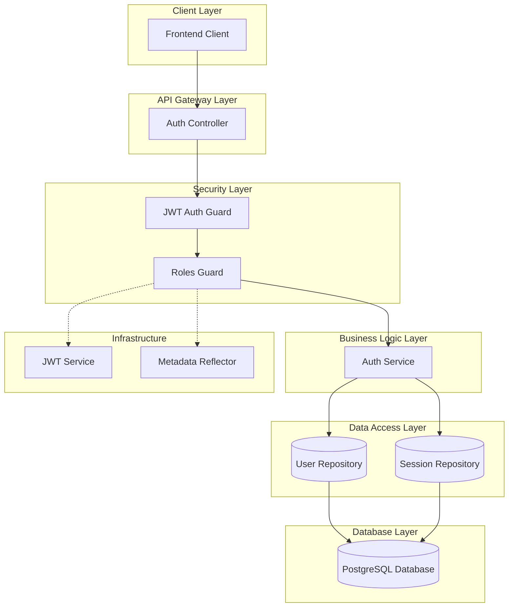
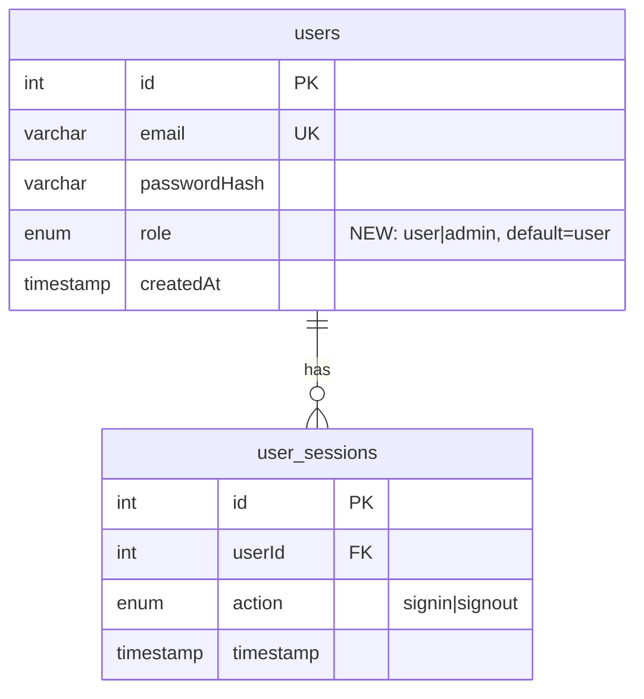
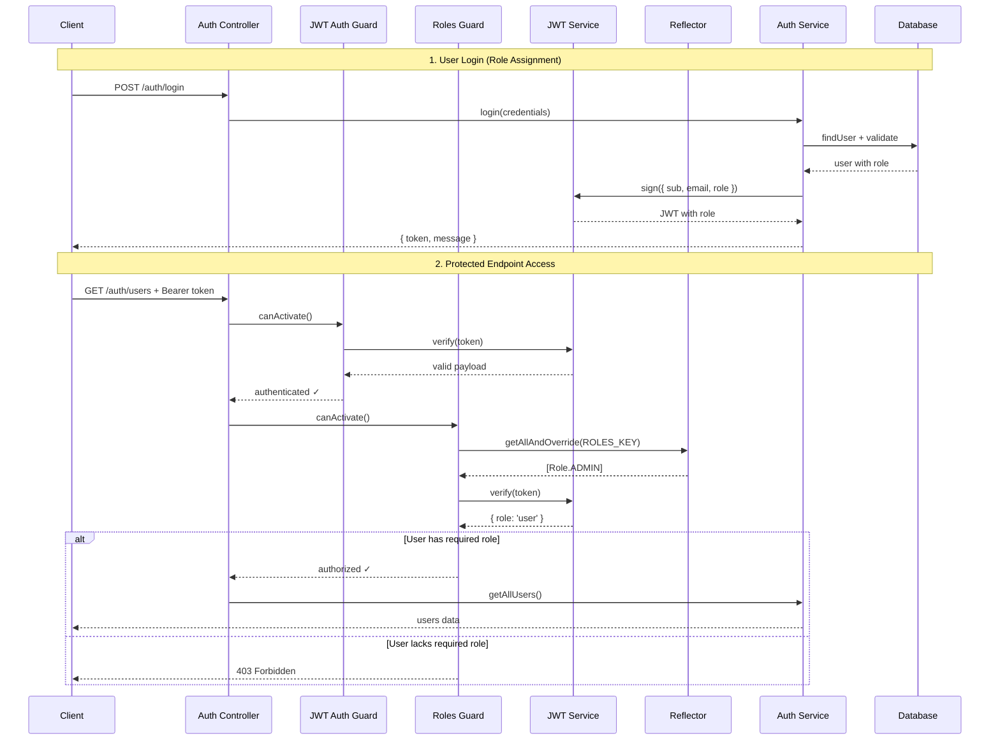
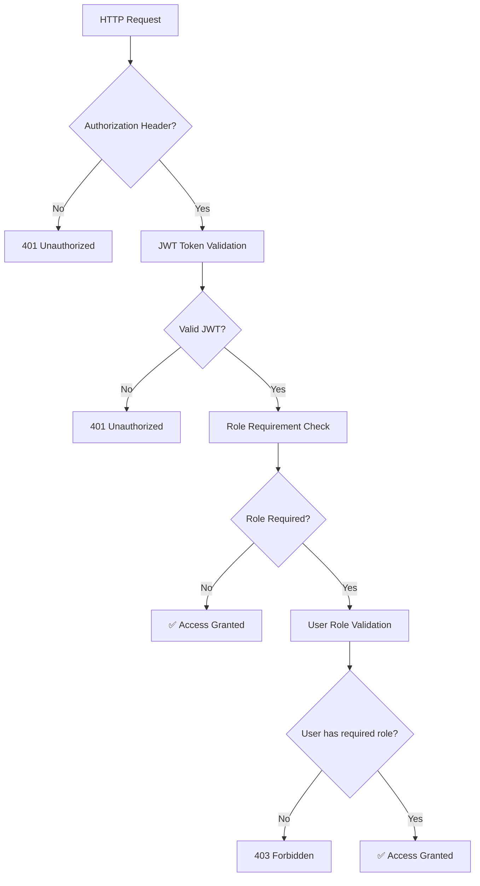

# 🔐 **Role-Based Access Control (RBAC) Implementation**

## **📋 Table of Contents**

- [🏗️ Architectural Overview](#️-architectural-overview)
- [🎯 RBAC Components](#-rbac-components)
- [📊 Database Schema](#-database-schema)
- [🔄 Authentication & Authorization Flow](#-authentication--authorization-flow)
- [🛡️ Security Model](#️-security-model)
- [🚀 API Endpoints & Permissions](#-api-endpoints--permissions)
- [💻 Technical Implementation Details](#-technical-implementation-details)
- [🧪 Testing & Usage](#-testing--usage)

---

## 🏗️ **Architectural Overview**

The RBAC system extends the existing JWT-based authentication with role-based authorization, following NestJS best practices and maintaining clean separation of concerns.

### **System Architecture**



### **Design Principles**

1. **🔒 Security First** - Multiple layers of validation (authentication → authorization)
2. **📦 Separation of Concerns** - Clear boundaries between authentication and authorization
3. **🎯 Decorator-Driven** - Use of metadata decorators for clean, declarative role assignments
4. **🔄 Token-Based** - Stateless role information embedded in JWT tokens
5. **🛡️ Guard Composition** - Composable guards for flexible security policies

---

## 🎯 **RBAC Components**

### **Core Components Architecture**

```mermaid
graph LR
    subgraph "Role Definition"
        RoleEnum[Role Enum]
        RoleDecorator[@Roles Decorator]
    end

    subgraph "Authorization Logic"
        RolesGuard[Roles Guard]
        Reflector[Metadata Reflector]
        JWTService[JWT Service]
    end

    subgraph "Data Models"
        UserEntity[User Entity]
        JWTPayload[JWT Payload Interface]
    end

    RoleEnum --> RoleDecorator
    RoleDecorator --> RolesGuard
    RolesGuard --> Reflector
    RolesGuard --> JWTService
    RolesGuard --> JWTPayload
    UserEntity --> JWTPayload
```

### **1. Role Enumeration**

```typescript
// src/auth/enums/roles.enum.ts
export enum Role {
  USER = 'user',
  ADMIN = 'admin',
}
```

### **2. Role Decorator**

```typescript
// src/auth/decorators/roles.decorator.ts
export const ROLES_KEY = 'roles';
export const Roles = (...roles: Role[]) => SetMetadata(ROLES_KEY, roles);
```

### **3. Roles Guard**

```typescript
// src/auth/guards/roles.guard.ts
@Injectable()
export class RolesGuard implements CanActivate {
  // Validates user roles against required endpoint permissions
}
```

---

## 📊 **Database Schema**

### **Enhanced User Entity**

```typescript
@Entity('users')
export class User {
  @PrimaryGeneratedColumn()
  id: number;

  @Column({ unique: true, type: 'varchar', length: 255 })
  email: string;

  @Column({ type: 'varchar', length: 255 })
  passwordHash: string;

  @Column({
    type: 'enum',
    enum: Role,
    default: Role.USER, // 👈 New role column with default
  })
  role: Role;

  @CreateDateColumn()
  createdAt: Date;

  @OneToMany(() => UserSession, (userSession) => userSession.user)
  sessions: UserSession[];
}
```

### **Database Schema Diagram**



---

## 🔄 **Authentication & Authorization Flow**

### **Complete RBAC Flow Diagram**



### **Authorization Decision Matrix**

| Endpoint                 | Authentication Required | Role Required | Access Granted To   |
| ------------------------ | ----------------------- | ------------- | ------------------- |
| `POST /auth/signup`      | ❌ No                   | -             | Everyone            |
| `POST /auth/login`       | ❌ No                   | -             | Everyone            |
| `POST /auth/logout`      | ✅ Yes                  | -             | Authenticated users |
| `GET /auth/users`        | ✅ Yes                  | `ADMIN`       | Admin users only    |
| `DELETE /auth/users/:id` | ✅ Yes                  | `ADMIN`       | Admin users only    |
| `PATCH /auth/update/:id` | ✅ Yes                  | `ADMIN`       | Admin users only    |

---

## 🛡️ **Security Model**

### **Multi-Layer Security Architecture**



### **Security Features**

1. **🔐 JWT-Based Stateless Authentication**
   - No server-side session storage required
   - Role information embedded in token payload
   - Configurable token expiration (24h default)

2. **🛡️ Role-Based Authorization**
   - Declarative role assignments using decorators
   - Runtime role validation against token payload
   - Flexible multi-role support (`@Roles(Role.ADMIN, Role.MODERATOR)`)

3. **🔒 Guard Composition**
   - Sequential guard execution (JWT → Roles)
   - Early termination on authentication failure
   - Clean separation of authentication vs authorization logic

4. **⚡ Performance Optimizations**
   - Metadata caching via Reflector
   - No database queries during authorization
   - Efficient role checking with array operations

---

## 🚀 **API Endpoints & Permissions**

### **Endpoint Security Configuration**

#### **Public Endpoints (No Authentication Required)**

```typescript
@Post('signup')  // Creates users with default 'user' role
async signup(@Body(ValidationPipe) signupDto: SignupDto) { }

@Post('login')   // Returns JWT with user's role
async login(@Body(ValidationPipe) loginDto: LoginDto) { }
```

#### **Authenticated Endpoints (JWT Required)**

```typescript
@Post('logout')
@UseGuards(JwtAuthGuard)  // Only authentication required
async logout(@GetUser() user) { }
```

#### **Admin-Only Endpoints (JWT + ADMIN Role Required)**

```typescript
@Get('users')
@UseGuards(JwtAuthGuard, RolesGuard)  // Composition of guards
@Roles(Role.ADMIN)                    // Role requirement metadata
async getAllUsers() { }

@Delete('users/:id')
@UseGuards(JwtAuthGuard, RolesGuard)
@Roles(Role.ADMIN)
async deleteUser(@Param('id') userId: number) { }

@Patch('update/:id')
@UseGuards(JwtAuthGuard, RolesGuard)
@Roles(Role.ADMIN)
async updateUser(@Param('id') userId: number, @Body() updateDto) { }
```

### **Response Patterns**

| Status Code | Scenario              | Response Body                                               |
| ----------- | --------------------- | ----------------------------------------------------------- |
| `200/201`   | Success               | `{ message: "...", data?: any }`                            |
| `400`       | Validation Error      | `{ statusCode: 400, message: [...], error: "Bad Request" }` |
| `401`       | Authentication Failed | `{ statusCode: 401, message: "Unauthorized" }`              |
| `403`       | Authorization Failed  | `{ statusCode: 403, message: "Forbidden resource" }`        |
| `404`       | Resource Not Found    | `{ statusCode: 404, message: "Not Found" }`                 |
| `409`       | Conflict              | `{ statusCode: 409, message: "..." }`                       |

---

## 💻 **Technical Implementation Details**

### **1. Enhanced JWT Payload Structure**

```typescript
export interface JwtPayload {
  sub: number; // User ID
  email: string; // User email
  role: Role; // 👈 NEW: User role for authorization
  createdAt: string; // Account creation timestamp
}
```

### **2. Roles Guard Implementation**

```typescript
@Injectable()
export class RolesGuard implements CanActivate {
  constructor(
    private reflector: Reflector, // For metadata retrieval
    private jwtService: JwtService, // For token verification
  ) {}

  canActivate(context: ExecutionContext): boolean {
    // 1. Extract required roles from decorator metadata
    const requiredRoles = this.reflector.getAllAndOverride<Role[]>(ROLES_KEY, [
      context.getHandler(),
      context.getClass(),
    ]);

    // 2. Allow access if no roles specified
    if (!requiredRoles) return true;

    // 3. Extract and verify JWT token
    const request = context.switchToHttp().getRequest();
    const token = this.extractTokenFromHeader(request);
    if (!token) return false;

    try {
      // 4. Decode token and extract user role
      const payload: JwtPayload = this.jwtService.verify(token);
      const userRole = payload.role;

      // 5. Check if user role matches any required roles
      return requiredRoles.some((role) => userRole === role);
    } catch {
      return false;
    }
  }

  private extractTokenFromHeader(request: any): string | undefined {
    const [type, token] = request.headers.authorization?.split(' ') ?? [];
    return type === 'Bearer' ? token : undefined;
  }
}
```

### **3. User Entity Updates**

The `User` entity now includes:

- **Role column** with enum type and default value
- **Database constraint** ensuring only valid roles
- **TypeORM synchronization** for automatic schema updates

### **4. Service Layer Enhancements**

```typescript
// Updated login method to include role in JWT
const payload: JwtPayload = {
  sub: user.id,
  email: user.email,
  role: user.role,  // 👈 Role included in token
  createdAt: user.createdAt.toISOString(),
};

// New admin-only methods
async getAllUsers(): Promise<any> {
  const users = await this.userRepository.find({
    select: ['id', 'email', 'role', 'createdAt'],
  });
  return { message: 'Users retrieved successfully', users };
}

async deleteUser(userId: number): Promise<AuthResponse> {
  // Cascade delete user sessions, then delete user
  await this.userSessionRepository.delete({ userId });
  await this.userRepository.remove(user);
  return { message: 'User deleted successfully' };
}
```

### **5. Strategy Updates**

```typescript
// JWT Strategy now validates and returns role information
async validate(payload: JwtPayload): Promise<{ userId: number; email: string; role: Role }> {
  if (!payload.sub || !payload.email || !payload.role) {
    throw new UnauthorizedException();
  }
  return {
    userId: payload.sub,
    email: payload.email,
    role: payload.role  // 👈 Role passed to request.user
  };
}
```

---

## 🧪 **Testing & Usage**

### **1. Create Test Users**

#### **Regular User (Default)**

```bash
curl -X POST http://localhost:3001/auth/signup \
  -H "Content-Type: application/json" \
  -d '{
    "email": "user@example.com",
    "password": "password123"
  }'
```

#### **Admin User (Manual Database Update Required)**

```sql
-- After creating user through signup endpoint
UPDATE users SET role = 'admin' WHERE email = 'admin@example.com';
```

### **2. Test Authentication Flow**

#### **Login and Get Token**

```bash
curl -X POST http://localhost:3001/auth/login \
  -H "Content-Type: application/json" \
  -d '{
    "email": "admin@example.com",
    "password": "password123"
  }'

# Response includes JWT token with role information
{
  "message": "Login successful",
  "token": "eyJhbGciOiJIUzI1NiIsInR5cCI6IkpXVCJ9..."
}
```

### **3. Test Role-Protected Endpoints**

#### **Admin-Only: List Users**

```bash
curl -X GET http://localhost:3001/auth/users \
  -H "Authorization: Bearer <ADMIN_JWT_TOKEN>"

# Success (200): Returns user list
# Failure (403): Forbidden if user role is not admin
```

#### **Admin-Only: Delete User**

```bash
curl -X DELETE http://localhost:3001/auth/users/2 \
  -H "Authorization: Bearer <ADMIN_JWT_TOKEN>"

# Success (200): User deleted
# Failure (403): Forbidden if user role is not admin
# Failure (404): User not found
```

### **4. JWT Token Verification**

Decode the JWT token at [jwt.io](https://jwt.io) to verify role inclusion:

```json
{
  "sub": 1,
  "email": "admin@example.com",
  "role": "admin",
  "createdAt": "2025-09-15T12:00:00.000Z",
  "iat": 1726405200,
  "exp": 1726491600
}
```

### **5. Expected Behavior**

| User Role | Endpoint Access        | Expected Result         |
| --------- | ---------------------- | ----------------------- |
| `USER`    | `GET /auth/users`      | 403 Forbidden           |
| `USER`    | `DELETE /auth/users/1` | 403 Forbidden           |
| `USER`    | `PATCH /auth/update/1` | 403 Forbidden           |
| `ADMIN`   | `GET /auth/users`      | 200 OK + user list      |
| `ADMIN`   | `DELETE /auth/users/1` | 200 OK + delete success |
| `ADMIN`   | `PATCH /auth/update/1` | 200 OK + update success |

---

## **🎯 Summary**

The RBAC implementation provides:

✅ **Complete role-based access control** with `USER` and `ADMIN` roles  
✅ **JWT-embedded role information** for stateless authorization  
✅ **Guard composition** for flexible security policies  
✅ **Database schema updates** with automatic synchronization  
✅ **Admin-only user management** endpoints  
✅ **Type-safe implementation** throughout the codebase  
✅ **Clean, maintainable architecture** following NestJS best practices

The system is production-ready and easily extensible for additional roles and permissions.
