# 🔐 **Role-Based Access Control (RBAC) Implementation**

## **📋 Table of Contents**

- [🏗️ Architectural Overview](#️-architectural-overview)
- [🎯 RBAC Components](#-rbac-components)
- [📊 Database Schema](#-database-schema)
- [🔄 Authentication & Authorization Flow](#-authentication--authorization-flow)
- [🛡️ Security Model](#️-security-model)
- [🚀 API Endpoints & Permissions](#-api-endpoints--permissions)
- [💻 Technical Implementation Details](#-technical-implementation-details)
- [🧪 Testing & Usage](#-testing--usage)

---

## 🏗️ **Architectural Overview**

The RBAC system extends the existing JWT-based authentication with role-based authorization, following NestJS best practices and maintaining clean separation of concerns.

### **System Architecture**


### **Design Principles**

1. **🔒 Security First** - Multiple layers of validation (authentication → authorization)
2. **📦 Separation of Concerns** - Clear boundaries between authentication and authorization
3. **🎯 Decorator-Driven** - Use of metadata decorators for clean, declarative role assignments
4. **🔄 Token-Based** - Stateless role information embedded in JWT tokens
5. **🛡️ Guard Composition** - Composable guards for flexible security policies

---

## 🎯 **RBAC Components**

### **1. Role Enumeration**

```typescript
// src/auth/enums/roles.enum.ts
export enum Role {
  USER = 'user',
  ADMIN = 'admin',
}
```

### **2. Role Decorator**

```typescript
// src/auth/decorators/roles.decorator.ts
export const ROLES_KEY = 'roles';
export const Roles = (...roles: Role[]) => SetMetadata(ROLES_KEY, roles);
```

### **3. Roles Guard**

```typescript
// src/auth/guards/roles.guard.ts
@Injectable()
export class RolesGuard implements CanActivate {
  // Validates user roles against required endpoint permissions
}
```

---

## 📊 **Database Schema**

### **Enhanced User Entity**

```typescript
@Entity('users')
export class User {
  @PrimaryGeneratedColumn()
  id: number;

  @Column({ unique: true, type: 'varchar', length: 255 })
  email: string;

  @Column({ type: 'varchar', length: 255 })
  passwordHash: string;

  @Column({
    type: 'enum',
    enum: Role,
    default: Role.USER, // 👈 New role column with default
  })
  role: Role;

  @CreateDateColumn()
  createdAt: Date;

  @OneToMany(() => UserSession, (userSession) => userSession.user)
  sessions: UserSession[];
}
```

### **Database Schema Diagram**


---

## 🔄 **Authentication & Authorization Flow**

### **Complete RBAC Flow Diagram**


### **Authorization Decision Matrix**

| Endpoint                 | Authentication Required | Role Required | Access Granted To   |
| ------------------------ | ----------------------- | ------------- | ------------------- |
| `POST /auth/signup`      | ❌ No                   | -             | Everyone            |
| `POST /auth/login`       | ❌ No                   | -             | Everyone            |
| `POST /auth/logout`      | ✅ Yes                  | -             | Authenticated users |
| `GET /auth/users`        | ✅ Yes                  | `ADMIN`       | Admin users only    |
| `DELETE /auth/users/:id` | ✅ Yes                  | `ADMIN`       | Admin users only    |
| `PATCH /auth/update/:id` | ✅ Yes                  | `ADMIN`       | Admin users only    |

---

## 🛡️ **Security Model**

### **Multi-Layer Security Architecture**

```mermaid
graph TD
    Request[HTTP Request] --> AuthHeader{Authorization Header?}
    AuthHeader -->|No| Reject1[401 Unauthorized]
    AuthHeader -->|Yes| JWTValidation[JWT Token Validation]

    JWTValidation --> JWTValid{Valid JWT?}
    JWTValid -->|No| Reject2[401 Unauthorized]
    JWTValid -->|Yes| RoleCheck[Role Requirement Check]

    RoleCheck --> RoleRequired{Role Required?}
    RoleRequired -->|No| Allow1[✅ Access Granted]
    RoleRequired -->|Yes| RoleValidation[User Role Validation]

    RoleValidation --> HasRole{User has required role?}
    HasRole -->|No| Reject3[403 Forbidden]
    HasRole -->|Yes| Allow2[✅ Access Granted]
```



### **Security Features**

1. **🔐 JWT-Based Stateless Authentication**
   - No server-side session storage required
   - Role information embedded in token payload
   - Configurable token expiration (24h default)

2. **🛡️ Role-Based Authorization**
   - Declarative role assignments using decorators
   - Runtime role validation against token payload
   - Flexible multi-role support (`@Roles(Role.ADMIN, Role.MODERATOR)`)

3. **🔒 Guard Composition**
   - Sequential guard execution (JWT → Roles)
   - Early termination on authentication failure
   - Clean separation of authentication vs authorization logic

4. **⚡ Performance Optimizations**
   - Metadata caching via Reflector
   - No database queries during authorization
   - Efficient role checking with array operations

---

## 🚀 **API Endpoints & Permissions**

### **Endpoint Security Configuration**

#### **Public Endpoints (No Authentication Required)**

```typescript
@Post('signup')  // Creates users with default 'user' role
async signup(@Body(ValidationPipe) signupDto: SignupDto) { }

@Post('login')   // Returns JWT with user's role
async login(@Body(ValidationPipe) loginDto: LoginDto) { }
```

#### **Authenticated Endpoints (JWT Required)**

```typescript
@Post('logout')
@UseGuards(JwtAuthGuard)  // Only authentication required
async logout(@GetUser() user) { }
```

#### **Admin-Only Endpoints (JWT + ADMIN Role Required)**

```typescript
@Get('users')
@UseGuards(JwtAuthGuard, RolesGuard)  // Composition of guards
@Roles(Role.ADMIN)                    // Role requirement metadata
async getAllUsers() { }

@Delete('users/:id')
@UseGuards(JwtAuthGuard, RolesGuard)
@Roles(Role.ADMIN)
async deleteUser(@Param('id') userId: number) { }

@Patch('update/:id')
@UseGuards(JwtAuthGuard, RolesGuard)
@Roles(Role.ADMIN)
async updateUser(@Param('id') userId: number, @Body() updateDto) { }
```

### **Response Patterns**

| Status Code | Scenario              | Response Body                                               |
| ----------- | --------------------- | ----------------------------------------------------------- |
| `200/201`   | Success               | `{ message: "...", data?: any }`                            |
| `400`       | Validation Error      | `{ statusCode: 400, message: [...], error: "Bad Request" }` |
| `401`       | Authentication Failed | `{ statusCode: 401, message: "Unauthorized" }`              |
| `403`       | Authorization Failed  | `{ statusCode: 403, message: "Forbidden resource" }`        |
| `404`       | Resource Not Found    | `{ statusCode: 404, message: "Not Found" }`                 |
| `409`       | Conflict              | `{ statusCode: 409, message: "..." }`                       |
