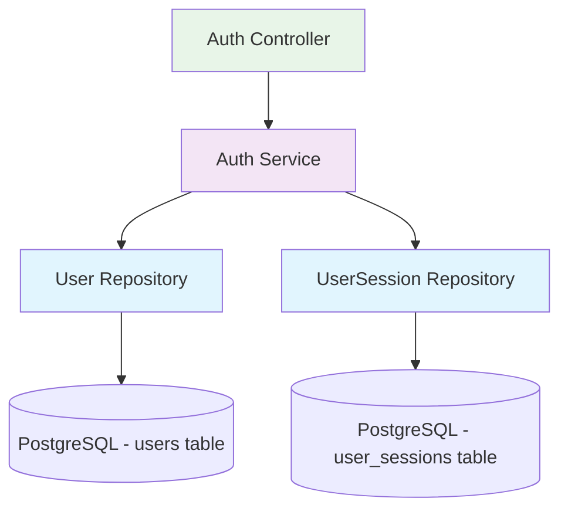

# **User Repository Explained**

The **User Repository** is a **data access layer** that provides an abstraction between your business logic and the database. It's part of the **Repository Pattern**, which is a design pattern that encapsulates the logic needed to access data sources.

## **🎯 What is a Repository?**

A repository acts as an **in-memory collection** of domain objects, providing a more object-oriented view of the database layer. Instead of writing raw SQL queries throughout your application, you use repository methods.

## **📂 In Your NestJS Application**

In your auth service (`src/auth/auth.service.ts`), you inject the User repository like this:

```typescript
@Injectable()
export class AuthService {
  constructor(
    @InjectRepository(User)
    private readonly userRepository: Repository<User>, // 👈 This is the User Repository
    // ... other dependencies
  ) {}
}
```

## **🔍 What Does the Repository Provide?**

The `Repository<User>` gives you access to these common database operations:

```typescript
// Create and save a new user
const user = this.userRepository.create({ email, passwordHash });
await this.userRepository.save(user);

// Find a user by email
const user = await this.userRepository.findOne({
  where: { email },
});

// Find user by ID
const user = await this.userRepository.findOne({
  where: { id: userId },
});

// Update user
await this.userRepository.update(userId, { email: newEmail });

// Delete user
await this.userRepository.delete(userId);

// Count users
const count = await this.userRepository.count();

// Find with relations
const users = await this.userRepository.find({
  relations: ['userSessions'],
});
```

## **🏗️ How It Works in Your Code**

Let's trace through your signup flow:

```typescript
// In auth.service.ts - signup method
async signup(signupDto: SignupDto): Promise<{ message: string }> {
  const { email, password } = signupDto;

  // 1. Use repository to check if user exists
  const existingUser = await this.userRepository.findOne({
    where: { email }
  });

  if (existingUser) {
    throw new ConflictException('User with this email already exists');
  }

  // 2. Use repository to create new user
  const hashedPassword = await bcrypt.hash(password, 10);
  const user = this.userRepository.create({  // Creates entity instance
    email,
    passwordHash: hashedPassword,
  });

  // 3. Use repository to save to database
  await this.userRepository.save(user);  // Persists to PostgreSQL

  return { message: 'User registered successfully' };
}
```

## **🔧 Repository vs Direct Database Access**

**❌ Without Repository (Raw SQL):**

```typescript
// You'd have to write raw SQL everywhere
await connection.query('SELECT * FROM users WHERE email = $1', [email]);
await connection.query(
  'INSERT INTO users (email, password_hash) VALUES ($1, $2)',
  [email, hashedPassword],
);
```

**✅ With Repository (Clean & Type-Safe):**

```typescript
// Clean, readable, and type-safe
await this.userRepository.findOne({ where: { email } });
await this.userRepository.save({ email, passwordHash });
```

## **🎯 Benefits of Repository Pattern**

1. **🔒 Type Safety** - TypeScript knows the User entity structure
2. **🧹 Clean Code** - No raw SQL scattered throughout your application
3. **🔄 Reusability** - Same repository methods used across different services
4. **🧪 Testability** - Easy to mock repositories for unit tests
5. **🔧 Maintainability** - Database logic centralized and consistent
6. **🏗️ Abstraction** - Business logic doesn't care about database implementation

## **📊 Repository in Your Architecture**



## **🔍 TypeORM Repository Methods**

Here are the most commonly used repository methods in your application:

### **Create Operations**

```typescript
// Create entity instance (not persisted yet)
const user = this.userRepository.create({ email, passwordHash });

// Save entity to database
await this.userRepository.save(user);

// Create and save in one step
const user = await this.userRepository.save({ email, passwordHash });
```

### **Read Operations**

```typescript
// Find one by criteria
const user = await this.userRepository.findOne({
  where: { email },
});

// Find by primary key
const user = await this.userRepository.findOneBy({ id: userId });

// Find with relations
const user = await this.userRepository.findOne({
  where: { id: userId },
  relations: ['sessions'],
});

// Find all users
const users = await this.userRepository.find();

// Count records
const count = await this.userRepository.count();
```

### **Update Operations**

```typescript
// Update by criteria
await this.userRepository.update({ id: userId }, { email: newEmail });

// Update and return affected rows
const result = await this.userRepository.update(userId, updateData);
```

### **Delete Operations**

```typescript
// Delete by criteria
await this.userRepository.delete({ id: userId });

// Soft delete (if enabled)
await this.userRepository.softDelete(userId);
```

## **🔍 In Summary**

The **User Repository** in your NestJS application is:

- A **TypeORM Repository instance** for the User entity
- **Injected** into your services via dependency injection
- Provides **pre-built methods** for common database operations
- Acts as a **bridge** between your business logic and PostgreSQL database
- Ensures **type safety** and **clean code** patterns

It's essentially your **gateway to the users table** in PostgreSQL, but wrapped in a clean, object-oriented interface that makes database operations intuitive and maintainable.
